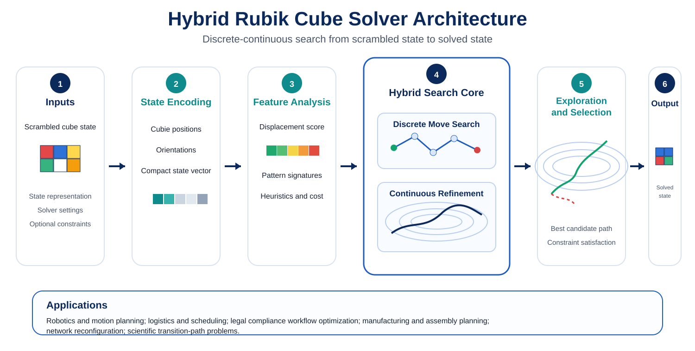

# Hybrid Rubik Cube Solver

**A research prototype for hybrid discrete–continuous state-transition optimization, demonstrated on Rubik-style search and physics-inspired energy landscapes.**

<p align="center">
  
</p>

## Overview

This repository studies a simple question with broader consequences:

> Given a known initial state **A**, a known goal state **B**, a set of legal actions, and a rugged cost landscape, how can an optimizer find a short, robust transition path efficiently?

The project uses the Rubik cube as a clean discrete benchmark and couples it to a physics-inspired continuous optimization prototype. The architecture combines:

- **Discrete search** over legal cube moves and macro-sequences.
- **Continuous refinement** over an energy/cost surface.
- **Adaptive policy guidance** for candidate macro-moves.
- **Annealing and perturbation-aware exploration** to escape poor local regions.
- **Normalized progress metrics** for compute-fair comparison inside each benchmark family.

The Rubik cube is the demonstration problem. The broader research target is **constrained transition-path optimization**.

## Applications

The same state-transition architecture can be adapted to:

- **Robotics and motion planning** — configuration A → configuration B under collision, stability, and actuator constraints.
- **Logistics and scheduling** — current allocation → target allocation while minimizing route, capacity, delay, and reassignment cost.
- **Legal/compliance workflow optimization** — current case/compliance state → required procedural state under deadlines, approvals, and policy constraints. This is decision support, not legal judgment.
- **Manufacturing and assembly planning** — sequence legal assembly/disassembly operations while avoiding collisions and expensive intermediate states.
- **Network reconfiguration** — change topology while preserving connectivity and minimizing disruption.
- **Scientific transition-path problems** — search between known endpoint states on rugged surrogate energy landscapes.

See [`docs/APPLICATIONS.md`](docs/APPLICATIONS.md) for a more detailed mapping.

## Repository structure

```text
.
├── src/hybrid_rubik/
│   ├── cube.py                 # legal 3×3 face-turn simulator + BFS/A* demo search
│   └── hatem.py                # Hybrid Adaptive Topological Energy Minimization prototype
├── benchmarks/
│   ├── run_cube_search_benchmark.py
│   ├── run_hatem_benchmark.py
│   ├── cube_search_summary.csv
│   ├── hatem_summary.csv
│   └── hatem_summary_by_scenario.csv
├── docs/
│   ├── ALGORITHM.md
│   ├── APPLICATIONS.md
│   ├── BENCHMARKS.md
│   └── figures/
├── tests/
├── pyproject.toml
└── README.md
```

## Quick start

```bash
git clone https://github.com/sciencemaths-collab/hybrid-rubik-cube-solver.git
cd hybrid-rubik-cube-solver
python -m venv .venv
source .venv/bin/activate      # Windows: .venv\\Scripts\\activate
pip install -e ".[dev]"
pytest -q
```

### Legal-move cube search demo

```python
from hybrid_rubik.cube import scramble, astar

state = scramble(["R", "U", "F", "R'"])
result = astar(state)
print(result.moves)
print(result.nodes_expanded)
```

The included cube solver is intentionally a **transparent research/demo implementation**, not a replacement for specialized competition solvers such as Kociemba-style two-phase engines.

### Reproduce the cube-search benchmark

```bash
PYTHONPATH=src python benchmarks/run_cube_search_benchmark.py \
  --depths 1,2,3,4 --trials 4
```

## Benchmark snapshot

### 1. Legal cube search

Shallow random scrambles were solved with both breadth-first search and A*. At depth 4, the current A* prototype expanded about **230.5 nodes on average**, compared with **1,208 nodes** for BFS in this run.

<p align="center">
  
  
</p>

### 2. Hybrid adaptive energy benchmark

The HATEM benchmark compares the trained hybrid optimizer with a continuous-only baseline across six controlled perturbations: baseline, bloat, shrink, electric forcing, heat addition, and heat removal.

Current benchmark configuration:

- 36 heterogeneous mini-units.
- 5 evaluation seeds.
- 1,600 objective evaluations per test run.
- 80 curriculum-training episodes using a pool of 200 randomized ground states.
- Same normalized score definition within this benchmark family.

Measured aggregate result in this run:

| Solver | Mean score | Score SD | Mean AUC | Mean runtime (s) |
|---|---:|---:|---:|---:|
| Hybrid-Adaptive (trained) | **0.8541** | **0.0311** | **0.5136** | 0.2005 |
| Knot-Continuous | 0.8113 | 0.1559 | 0.4489 | **0.1754** |

The hybrid method produced a higher aggregate score and substantially lower score variance in this benchmark, while the continuous baseline was slightly faster.

<p align="center">
  
</p>

Full methodology and per-scenario results are in [`docs/BENCHMARKS.md`](docs/BENCHMARKS.md).

## Algorithm in one view

```text
State A
  ↓
Encode state / constraints
  ↓
Measure disorder, displacement, and cost
  ↓
┌──────────────────────────────────────┐
│ Hybrid search core                   │
│  • discrete legal / macro moves      │
│  • learned/adaptive move scoring     │
│  • continuous energy refinement      │
│  • annealing / perturbation handling │
└──────────────────────────────────────┘
  ↓
Explore candidate paths
  ↓
Rank / validate
  ↓
State B + path diagnostics
```

For the continuous research prototype, each mini-unit has its own frequency-, vibration-, and energy-like parameters. The learned policy ranks structural macro-moves while SPSA-style continuous updates refine the configuration.

## Scientific positioning

This repository is a **research prototype**. The terms *energy landscape*, *least action*, *frequency*, *vibration*, and *topology* are used as modeling constructs in the synthetic HATEM benchmark. They should not be interpreted as a claim that the cube benchmark reproduces a physical thermodynamic system.

Likewise, cross-domain applications require domain-specific state definitions, legal actions, constraints, and validation. A strong result on the cube or synthetic energy benchmark does not by itself establish performance in robotics, law, logistics, molecular simulation, or other target domains.

## Tests

```bash
pytest -q
```

Current smoke tests check legal face-turn inverses, four-turn identity, and short-scramble solution verification.

## Documentation

- [Algorithm and mathematical design](docs/ALGORITHM.md)
- [Benchmarks and methodology](docs/BENCHMARKS.md)
- [Application mapping](docs/APPLICATIONS.md)

## License

MIT. See [`LICENSE`](LICENSE).
