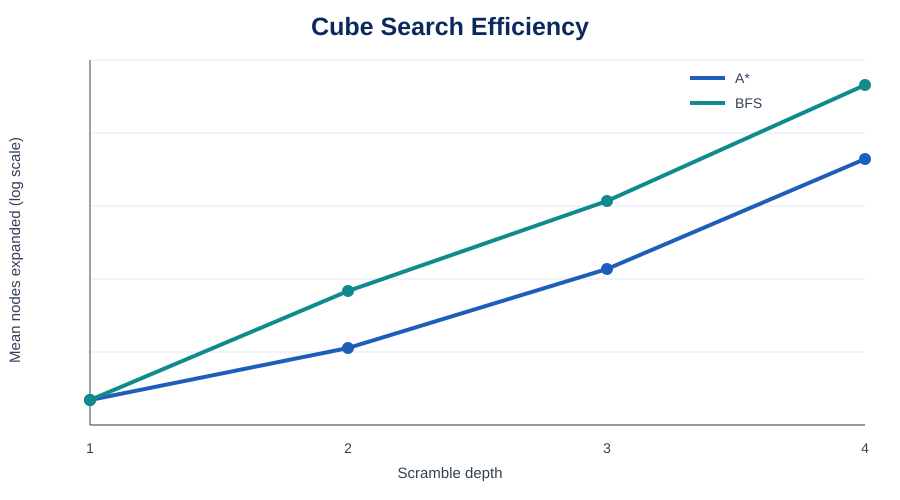
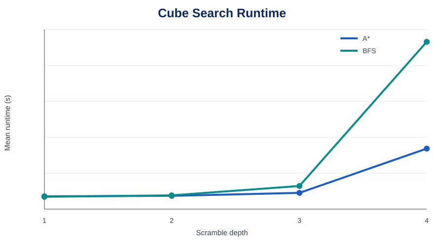
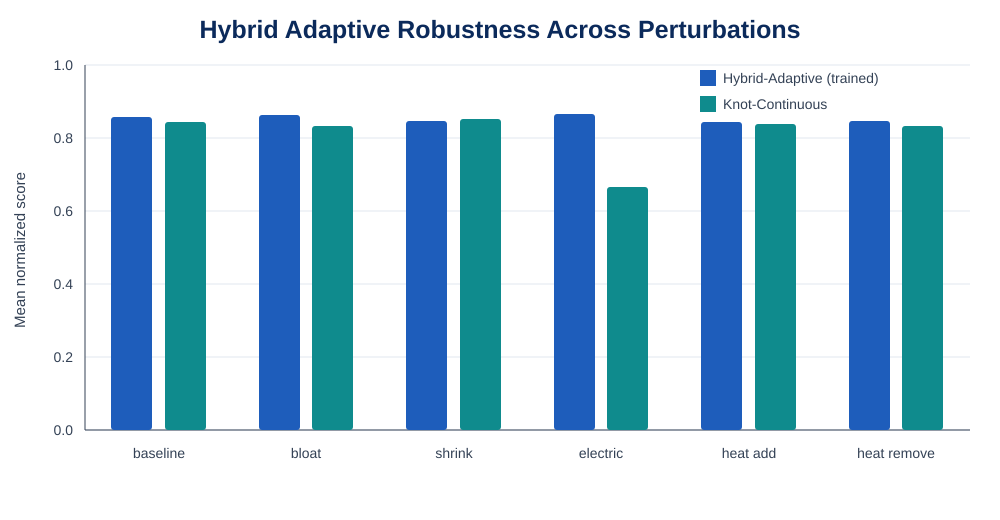

# Benchmarks

All numbers in this document are generated from scripts included in this repository. They are prototype measurements, not claims of state-of-the-art performance.

## A. Legal cube-search benchmark

### Setup

- Legal 3×3 face turns generated from exact facelet permutations.
- Scramble depths: 1–4 moves.
- 4 random trials at each depth.
- Compared BFS and the repository's transparent A* heuristic.
- Maximum node budget: 250,000 nodes.

### Results

| Depth | Solver | Solve rate | Mean nodes expanded | Mean runtime (s) | Mean solution length |
|---:|---|---:|---:|---:|---:|
| 1 | A* | 1.00 | 1.00 | 0.000161 | 1.00 |
| 1 | BFS | 1.00 | 1.00 | 0.000030 | 1.00 |
| 2 | A* | 1.00 | 3.25 | 0.000418 | 2.00 |
| 2 | BFS | 1.00 | 11.75 | 0.000754 | 2.00 |
| 3 | A* | 1.00 | 19.00 | 0.002299 | 2.50 |
| 3 | BFS | 1.00 | 88.25 | 0.006259 | 2.50 |
| 4 | A* | 1.00 | **230.50** | **0.028073** | 4.00 |
| 4 | BFS | 1.00 | 1,208.00 | 0.090071 | 4.00 |





### Interpretation

For these shallow scrambles, the heuristic search substantially reduces node expansion as depth increases. This is a demonstration benchmark only; specialist Rubik solvers use substantially stronger representations and heuristics.

---

## B. HATEM hybrid-adaptive benchmark

### Setup

- 36 heterogeneous mini-units.
- Scenarios: baseline, bloat, shrink, electric, heat_add, heat_remove.
- Test seeds: 3, 7, 11, 19, 23.
- Evaluation budget: 1,600 objective evaluations/run.
- Hybrid policy trained for 80 curriculum episodes.
- Training ground-state pool: 200 randomized targets.
- Training episode budget: 600 evaluations.

### Aggregate results

| Solver | Mean score | Score SD | Mean AUC | AUC SD | Mean runtime (s) |
|---|---:|---:|---:|---:|---:|
| Hybrid-Adaptive (trained) | **0.8541** | **0.0311** | **0.5136** | 0.1037 | 0.2005 |
| Knot-Continuous | 0.8113 | 0.1559 | 0.4489 | 0.1278 | **0.1754** |

### Per-scenario score

| Scenario | Hybrid-Adaptive | Continuous |
|---|---:|---:|
| baseline | **0.8572** | 0.8427 |
| bloat | **0.8632** | 0.8332 |
| electric | **0.8659** | 0.6663 |
| heat_add | **0.8448** | 0.8390 |
| heat_remove | **0.8456** | 0.8337 |
| shrink | 0.8478 | **0.8531** |

The hybrid method wins five of six scenario means in this run. The shrink scenario is the exception. The largest gap appears under the synthetic electric perturbation, where the continuous baseline also shows much larger variance.



## Reproduction

Cube search:

```bash
PYTHONPATH=src python benchmarks/run_cube_search_benchmark.py --depths 1,2,3,4 --trials 4
```

HATEM:

```bash
PYTHONPATH=src python benchmarks/run_hatem_benchmark.py
```

## Limitations

- Cube-search trials are intentionally shallow.
- HATEM uses a synthetic objective and synthetic frequency/vibration/energy-like parameters.
- HATEM and the legal cube-search benchmark measure different systems and should not be directly ranked against each other by raw score.
- Application claims require domain-specific datasets and baselines.
